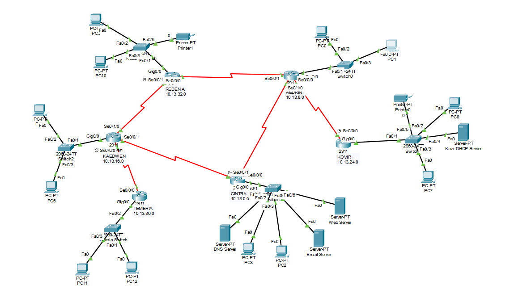
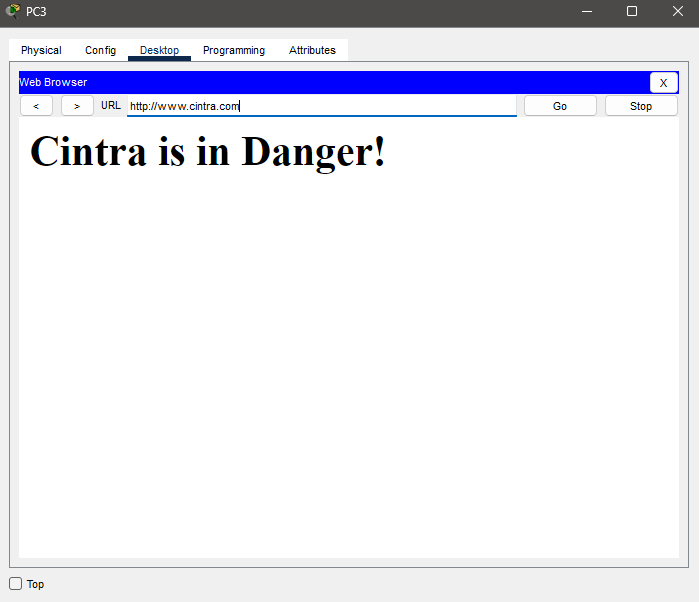
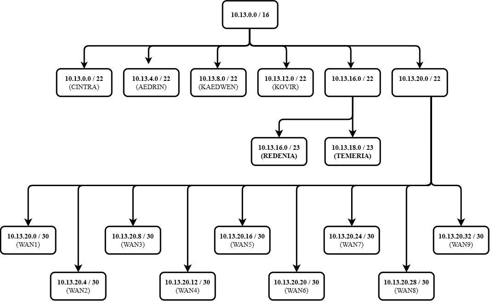
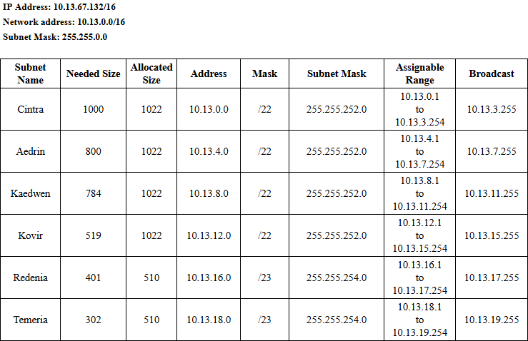
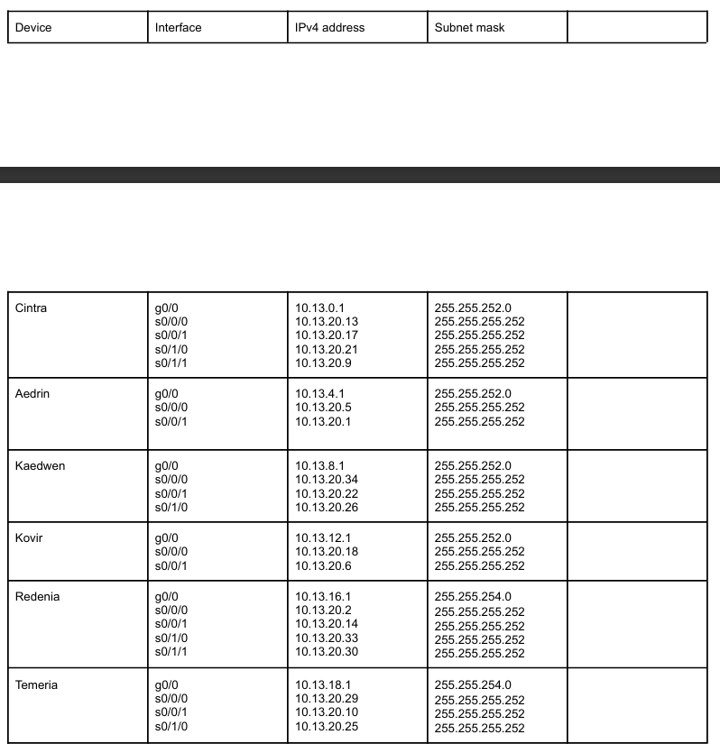

# Northern Kingdoms Network Design
 
A full network design and implementation in Cisco Packet Tracer, connecting six sites under a shared address space with mixed static/dynamic routing, DHCP, and distributed network services.
 
## The Problem
 
Design and implement a network connecting six sites (Cintra, Aedrin, Kaedwen, Kovir, Redenia, Temeria), each with a different number of hosts, under the following constraints:
 
- Subnet a single `/16` address block across all six sites using VLSM, sized to each site's actual host count to minimize address waste.
- Only odd host IP addresses may be assigned to end devices.
- Cintra and Aedrin use static IP addressing; the remaining four sites use DHCP.
- Cintra hosts a Web Server (resolved via a DNS Server) and shares an Email Server with Temeria for inter-site mail.
- Kovir and Redenia each get a network printer in place of a database.
- Aedrin, Cintra, and Kaedwen route dynamically (RIPv2); Kovir, Redenia, and Temeria route statically.
- At least one floating static route is required as a backup path.
- Default routes are reserved for ISP-bound traffic only — every inter-site path must use a real static or dynamic route.
- Every site must be able to reach every other site.

## What Was Built
 
All of the above is fully implemented: VLSM-based addressing sized to each site's host count, static IP on Cintra and Aedrin with DHCP elsewhere, the required dynamic/static routing split across all six sites, a floating static route as backup, full inter-site reachability with no default-route shortcuts, and every required service (Web, DNS, Email, printers) deployed at its specified site.



Six sites interconnected over six point-to-point WAN links, carved from the same `10.13.0.0/16` block used for the site networks. Aedrin and Kaedwen form the core of the WAN, each connecting to three other sites; Kovir and Temeria sit as single-link leaf sites.

## Network Services

| Site    | LAN Network     | Hosts Needed | Addressing | Routing | Services |
|---------|-----------------|:------------:|:----------:|:-------:|----------|
| Cintra  | 10.13.0.0/21    | 1000         | Static     | RIPv2   | Web, DNS, Email Server |
| Aedrin  | 10.13.8.0/21    | 800          | Static     | RIPv2   | — |
| Kaedwen | 10.13.16.0/21   | 784          | DHCP       | RIPv2   | — |
| Kovir   | 10.13.24.0/21   | 519          | DHCP       | Static  | Printer, DHCP Server |
| Redenia | 10.13.32.0/22   | 401          | DHCP       | Static  | Printer |
| Temeria | 10.13.36.0/22   | 302          | DHCP       | Static  | Email access (Cintra-hosted) |

The Cintra DNS server and Web server resolves:

```text
www.cintra.com
```

The website displays:



Email communication is configured between **Cintra and Temeria**.

## Addressing

### VLSM Tree



Each LAN subnet is sized by VLSM to fit its host count with minimal waste; WAN links use `/29` subnets carved from a shared `10.13.40.0/24` block.

### Subnet Allocation



### IP Addressing



## Routing

The network uses a combination of **RIPv2 and static routing**.

- Aedrin, Cintra, and Kaedwen use RIPv2.
- Kovir, Redenia, and Temeria use static routes.
- A floating static route provides a backup path.
- Default routes are not used for communication between the six kingdom networks.

## Repository Structure

```text
Northern-War-Project/
├── diagrams/
│   ├── cintraDanger.png
│   ├── topology.png
│   ├── vlsm-tree.png
│   ├── vlsm-subnetting-table.png
│   └── interface-addressing-table.png
├── config/
│   ├── Aedrin.txt
│   ├── Cintra.txt
│   ├── Kaedwen.txt
│   ├── Kovir.txt
│   ├── Redenia.txt
│   └── Temeria.txt
└── packet-tracer/
    └── Northern-War.pkt
```

## Skills Demonstrated
 
- VLSM subnetting and IP address planning under real allocation constraints
- Static and dynamic (RIPv2) routing design across a multi-site WAN topology
- Floating static routes for automatic path failover
- DHCP server and relay configuration across subnets
- Network service deployment (Web, DNS, Email, print) mapped to specific sites
- Cisco Packet Tracer
- Network Troubleshooting
